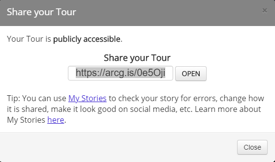

## About
Last Updated *[add date here]*   
Created by [OSU Maps and Spatial Data](https://info.library.okstate.edu/map-room)

## Table of Contents
- Introduction 
- *[Story Map Tour]*
- - Making a Story Map Tour
- - Preview
- - Share
- Conclusion
- Further Reading/Resources

## Introduction
Story Maps are a relatively new and unique way of telling stories by using maps, images and videos. Esri offers many different Story Map templates that can be utilized for a multitude of projects and purposes.

## *[Story Map Tour]*
The Story Map Tour allows you to link photos and videos with an interactive map. The most popular use for this kind of story map is to create guided walking tours for readers.

#### Making a Story Map Tour
1. In order to locate the older story map templates, visit this [website](https://storymaps-classic.arcgis.com/en/app-list/?buildApp=true).
2. Locate the Story Map Tour and select **Build**

3. A pop up will appear where you select how you plan to access the photos you wish to use. For this guide, we will upload them from a computer file into ArcGIS. Select the ArcGIS icon under **I need to upload my images**.

4. A new pop up appears. Give the layer a name and select the desired output folder. Then select **Create the layer**.

5. A window appears where you can add your first tour point. Select or drop a picture into the box. 

6. The picture appears in the *Media* tab along with its information. Here you can change the picture if you made a mistake and select the desired resolution.

7. If you would like to add additional information, navigate to the *Information* tab. Here you can change the name of the tour point and give it a description.

8. If you need to change or enter a location, go to the *Location* tab. Here you can adjust the latitude and longitude of your tour point and change the color of the pin. 

9. When you are satisfied, click **Add tour point**.

10. A preview and workspace now appear.

11. Be sure to add a title at the top of the page. 

12. If you still need to change the thumbnail or picture, click on the *Pencil* icon in the upper lefthand corner of the thumbnail. Select the desired photo or cancel.

13. If you wish to alter the title or description, just click in the appropriate box. 

14. If you would like to add a basemap, click the *Basemap* icon in the upper right hand corner of the map box. Select the desired map.

15. You can also change the color of the pin.

16. Like most esri maps, you can zoom in and out, return to the set extent and explore the map.

17. Be sure to save your project periodically. The *Save* icon is in the top left corner of the screen. 

18. Click on the *Settings* icon to open a new window.

19. The *Settings* window appears. There are many tabs here that can be used to customize your project. We will focus on the *Extent* tab, but feel free to explore the other options.

20. Click on the *Entent* tab. Here we can select what portion of the map we would like to showcase in our story map.

21. Zoom in to the area you would like to use and select **Draw a new extent**. Draw a box around the area that is to be used. 

22. To preview this extent, click **Preview on Map Tour**. The map in the workspace should shift.

23. When you are satisfied, click **Apply**.

24. To add a new slide, click the *Add* icon. 

25. Repeat steps 5-9.
26. To alter the order of the points, click the bottom icon on the toolbar.

27. To reorder a slide, simply drag and drop it where you would like it to be.

28. If you would like to set a cover page, you can click the box next to **Use the first point as a cover page**.

29. You can reset any changes by clicking **Reset order and hidden points**.

30. To hide or delete an image, select it and click **Hide** or **Delete**.

31. When you are satisfied, click **Apply**.

32. Remember to keep saving the project!

#### Preview
1. When you are ready to preview your story map, click the *View Story* icon.

2. This opens a new tab that allows you to navigate through your story map as a reader.

3. When you are done viewing the story map, close the tab.

#### Share
1. To share your story map click the *Share* icon.

2. You can choose to **Share publicly**, **Share with my Organization** or **Close**.
3. If you choose to **Share publicly** a new window opens with a link to your story. You can copy this and save it to later share with people. 

## Conclusion

## Further Reading/Resources

[Return to Top](#about)
